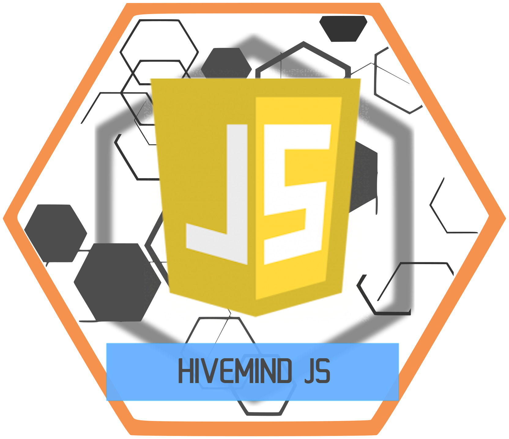

# HiveMind JS



JavaScript client for HiveMind, up to protocol v3 (Noise with argon2id PSK derivation). Runs in the browser and in Node.js 18+.

Uses the native [Web Crypto API](https://developer.mozilla.org/en-US/docs/Web/API/Web_Crypto_API) (`crypto.subtle`) for X25519, SHA-256, HMAC and AES-GCM, plus [`@noble/ciphers`](https://github.com/paulmillr/noble-ciphers) and [`@noble/hashes`](https://github.com/paulmillr/noble-hashes) (pure-JS, audited, no WASM) for the two primitives Web Crypto lacks: **ChaCha20-Poly1305** (the default protocol-v3 Noise AEAD) and **argon2id** (the default PSK derivation). This gives HiveMind-js **full cipher parity with hivemind-core**, every registered Noise suite and PSK derivation. Node.js 18+; protocol v3 needs Node.js 20+ (Web Crypto X25519).

## Install

```bash
npm install hivemind-js
```

In Node.js the `@noble` dependencies are resolved automatically. For the browser see [Browser build](#browser-build) below, `hivemind.js` itself is a plain script, and it expects the two `@noble` primitives to be exposed on `globalThis.HiveMindNoble` (a five-line bundle step). Without them the client still runs, but degrades to the Web-Crypto-only AES-GCM + PBKDF2 subset (it cannot negotiate the default ChaChaPoly suite or derive an argon2id PSK).

## Quick start (browser)

```html
<!DOCTYPE html>
<html>
<head>
    <meta charset="UTF-8">
    <title>HiveMind JS Demo</title>
    <!-- Web Crypto is built in; expose @noble on globalThis.HiveMindNoble
         for the default ChaChaPoly suite + argon2id PSK, see "Browser build" -->
    <script src="static/js/hivemind.js"></script>
</head>
<body>
<script>
    const hivemind = new JarbasHiveMind();

    // Override event hooks before connecting
    hivemind.onHiveConnected = function () {
        // Fires only after the full handshake completes, not on socket open
        window.alert("Connected to HiveMind!");
    };

    hivemind.onMycroftSpeak = function (mycroft_message) {
        window.alert(mycroft_message.data.utterance);
    };

    hivemind.onHiveDisconnected = function () {
        window.alert("HiveMind connection lost.");
    };

    // connect(host, port, username, accessKey, password)
    // The 5th argument is the V1 shared password used for PBKDF2 key derivation.
    hivemind.connect("127.0.0.1", 5678, "HivemindWebChat", "ivf1NQSkQNogWYyr", "mypassword");

    // sendUtterance / sendMessage are async, safe to call after onHiveConnected fires
    hivemind.onHiveConnected = async function () {
        await hivemind.sendUtterance("tell me a joke");
    };
</script>
</body>
</html>
```

## Quick start (Node.js)

In Node.js, supply a WebSocket implementation on `globalThis` (the client uses the
browser `WebSocket` global). Any standard implementation such as [`ws`](https://www.npmjs.com/package/ws) works:

```javascript
// CommonJS
const { JarbasHiveMind } = require('hivemind-js');
globalThis.WebSocket = require('ws');

// or ESM
// import { JarbasHiveMind } from 'hivemind-js';
// import WebSocket from 'ws';
// globalThis.WebSocket = WebSocket;

const hivemind = new JarbasHiveMind();

hivemind.onHiveConnected = async () => {
    console.log('connected');
    await hivemind.sendUtterance('tell me a joke');
};

hivemind.onMycroftSpeak = (msg) => console.log('speak:', msg.data.utterance);

// connect(host, port, username, accessKey, password)
hivemind.connect('127.0.0.1', 5678, 'HivemindNode', 'ivf1NQSkQNogWYyr', 'mypassword');
```

Node needs `ws` only as a dev dependency (Node lacks a built-in `WebSocket`
global). The runtime crypto dependencies are `@noble/ciphers` and
`@noble/hashes`, small, audited, pure-JS, used only for ChaCha20-Poly1305 and
argon2id; everything else uses native Web Crypto.

## API reference

### `connect(host, port, username, accessKey, password, options?)`

Opens a WebSocket connection and runs the handshake automatically. When the
server offers protocol v3 (Noise) and a PSK is available, the Noise handshake
is used; otherwise the legacy Protocol V1 handshake runs.

| Argument | Type | Description |
|----------|------|-------------|
| `host` | string | Server hostname or IP |
| `port` | number | Server port (default HiveMind port: 5678) |
| `username` | string | Client name / user-agent string |
| `accessKey` | string | Access key issued to the client |
| `password` | string | Shared password for PBKDF2 session-key derivation |
| `options` | object | Optional, protocol v3 (Noise) settings, see below |

`options` fields (all optional):

| Field | Type | Description |
|-------|------|-------------|
| `psk` | `Uint8Array` or hex string | Optional pre-provisioned 32-byte Noise PSK. Normally unnecessary, a `password` is stretched with argon2id on-device to the same value; provide `psk` only to skip derivation or when no password is configured |
| `serverNoiseKey` | hex string | Pinned server static X25519 public key; enables `KKpsk0` and aborts on mismatch (TOFU pinning) |
| `noiseStaticKey` | `Uint8Array` or hex string | This node's static X25519 private key. Optional — when omitted, the client generates one and remembers it for you, keyed by `host`/`port`/`accessKey`: `localStorage` in the browser, an in-memory process-lifetime cache in Node.js (Node has no `localStorage`, and this library will not silently write key material to a file in your home directory — pass this option yourself if you need a Node process identity to survive a restart). An explicit value here always wins over anything stored, and is itself persisted for later connects. This matters because the server pins a client's static key on first use: regenerating it every connection gets the client locked out |
| `maxProtocolVersion` | number | Cap the negotiated protocol version (default `3`) |

Returns the raw `WebSocket` instance.

### `sendUtterance(utterance)` → `Promise`

Sends a `recognizer_loop:utterance` bus message. Must be called after `onHiveConnected`.

### `sendMessage(hiveMessage)` → `Promise`

Sends an arbitrary pre-built HiveMessage (plain object). Encrypts it with the session key. Throws if called before `onHiveConnected`.

Use `_wrap(msg_type, payload)` to build a correctly-shaped HiveMessage envelope.

### Event hooks

Override these on your instance before calling `connect()`:

| Hook | When it fires |
|------|---------------|
| `onHiveConnected()` | Handshake complete, safe to call `sendMessage` |
| `onHiveDisconnected()` | WebSocket closed |
| `onHiveError(err)` | The hub refused or aborted the connection, e.g. the WebSocket closed before the handshake reached READY. A close with code `1008` means the hub rejected the credentials — treated as fatal. Fires before `onHiveDisconnected()` |
| `onMycroftMessage(msg)` | Any `bus` message received |
| `onMycroftSpeak(msg)` | `bus` message with type `speak` |
| `onHiveBroadcast(msg)` | `broadcast` message received |
| `onHivePropagate(msg)` | `propagate` message received |
| `onHiveIntercom(msg)` | `intercom` message received |
| `onHivePing(msg)` | `ping` message received |

## Binary / binarize mode

When the server advertises `binarize: true` in its HANDSHAKE, the client opts in and both sides switch to binary WebSocket frames. Every frame is an AES-GCM-encrypted payload using the bitstring wire format.

```javascript
// Sending a raw audio frame
const metadata = { sample_rate: 16000, sample_width: 2 };
const frame = encodeBitstring('bin', wavBytes, metadata, BIN_TYPES.RAW_AUDIO);
await hivemind._sendEncryptedBinary(frame);

// Handling incoming binary frames (e.g. TTS audio)
const orig = hivemind._handleBinaryWsMessage.bind(hivemind);
hivemind._handleBinaryWsMessage = async function(buffer) {
    const decrypted = await decryptAesGcmBin(this._sessionKey, new Uint8Array(buffer));
    const decoded   = await decodeBitstring(decrypted);
    if (decoded.binType === BIN_TYPES.TTS_AUDIO) {
        // play audio...
        return;
    }
    await orig(buffer);
};
```

Available globals (after loading `hivemind.js`): `encodeBitstring`, `decodeBitstring`, `encryptAesGcmBin`, `decryptAesGcmBin`, `BIN_TYPES`.

See [`docs/binary.md`](docs/binary.md) for the full frame layout, bitstring format, and API reference.

## Protocol v3, Noise handshake

When the server advertises `max_protocol_version >= 3` together with its Noise
`patterns`/`suites`, the client runs an authenticated key exchange built on the
[Noise Protocol Framework](https://noiseprotocol.org/noise.html) (revision 34)
instead of the legacy handshake, see HIVEMIND-CRYPTO-1 §3.4. It provides
mutual static-key authentication, forward secrecy, password authentication
without an offline-attackable artifact on the wire, and transcript binding
(any tampering with the negotiation aborts the handshake).

This client supports **both** registered cipher suites (HIVEMIND-CRYPTO-1
§3.4.1) across **both** patterns, full parity with hivemind-core:

- `Noise_XXpsk2_25519_ChaChaPoly_SHA256`, **default**, general case (static
  keys exchanged in the handshake, TOFU-then-pin)
- `Noise_KKpsk0_25519_ChaChaPoly_SHA256`, **default**, pre-provisioned static
  keys (pass `serverNoiseKey`)
- `Noise_XXpsk2_25519_AESGCM_SHA256` / `Noise_KKpsk0_25519_AESGCM_SHA256` ,
  Web-Crypto-native AES-GCM variants

ChaCha20-Poly1305 (via `@noble/ciphers`) is **preferred**, matching the Python
client's preference order; the suite is negotiated from the server's advertised
list, with AES-GCM chosen only when the server offers AES-GCM but not
ChaChaPoly. When no mutual suite exists the client falls back to the legacy
v0-v2 handshake.

After the handshake, **all** session traffic travels as Noise transport
messages (binary WebSocket frames) under per-direction cipher states with
strictly sequential 64-bit counter nonces, replayed, reordered or tampered
messages fail authentication and terminate the session.

### The PSK, password (default) vs provisioning

The shared site password enters the handshake as a 32-byte Noise PSK. The
server derives it as `argon2id(password, SHA-256(node_id))` by default, and this
client derives the **same** value on-device with `@noble/hashes` argon2id (same
parameters: `t=3, m=64 MiB, p=1, len=32, id, v0x13`). So a password-configured
client **just works** against a stock hivemind-core, with no server-side
configuration and no provisioning step (HIVEMIND-CRYPTO-1 §3.4.4). The derivation
is byte-verified against `poorman_handshake.noise.derive_psk` in the test suite.

Alternative PSK inputs, in priority order:

- **Provisioned PSK:** pass `options.psk` (32-byte `Uint8Array` or hex) to skip
  derivation. Compute it on any capable host, e.g. Python:

  ```python
  from poorman_handshake.noise import derive_psk
  psk = derive_psk("site password", node_id="<server node_id>")
  print(psk.hex())  # -> options.psk
  ```

- **Password via PBKDF2:** if the server explicitly advertises `PBKDF2` as its
  PSK KDF in the handshake parameters, the client derives
  `PBKDF2-HMAC-SHA256(password, SHA-256(node_id), >=100000, 32)` instead.

Only in a minimal browser deployment that ships `hivemind.js` **without** the
`@noble` bundle (no ChaChaPoly, no argon2id) does the client become a
constrained peer: it then needs a provisioned `options.psk` or a PBKDF2-
advertising server, and logs a clear operator error otherwise.

Requires `X25519` support in Web Crypto: all modern browsers, Node.js 20+.

### Browser build

`static/js/hivemind.js` is a plain script with no build step of its own, but the
default ChaChaPoly suite and argon2id PSK need the two `@noble` primitives
present as `globalThis.HiveMindNoble`. Expose them with a tiny ESM shim (both
libraries are ESM, browser-friendly, and need no bundler):

```html
<script type="module">
  import { chacha20poly1305 } from 'https://esm.sh/@noble/ciphers@2/chacha.js';
  import { argon2id } from 'https://esm.sh/@noble/hashes@2/argon2.js';
  globalThis.HiveMindNoble = { chacha20poly1305, argon2id };
</script>
<script src="static/js/hivemind.js"></script>
```

Or bundle the same three lines with your app (esbuild/rollup/vite) and drop the
CDN import. If `globalThis.HiveMindNoble` is absent the client still loads and
runs the Web-Crypto-only subset.

## Protocol V1 overview

Connection flow:

```
WebSocket open  →  Server HELLO  →  Server HANDSHAKE (request)
→  Client HANDSHAKE (envelope)  →  Server HANDSHAKE (response + envelope)
→  (both sides derive session key via PBKDF2)
→  Client HELLO (encrypted)  →  onHiveConnected()  →  normal encrypted traffic
```

Key points:
- `onHiveConnected` fires **after** the full handshake, not on WebSocket `open`
- All regular messages are encrypted with AES-GCM (JSON-HEX encoding by default)
- The session key is derived fresh per-connection, the password is never transmitted

See [`docs/handshake.md`](docs/handshake.md), [`docs/encryption.md`](docs/encryption.md), [`docs/protocol.md`](docs/protocol.md), and [`docs/binary.md`](docs/binary.md) for details.

## Running the tests

Requires Node.js 18+. No npm install needed.

```bash
cd HiveMind-js
node --test test/*.test.js
# or via package.json script:
npm test
```

Test suite (72 tests across 5 files):

| File | What it covers |
|------|----------------|
| `test/crypto.test.js` | `PasswordHandShake`: hSub creation, IV extraction, PBKDF2 key derivation, cross-compat with Python vectors |
| `test/encryption.test.js` | AES-GCM encrypt/decrypt, wire format, Python-vector round-trip |
| `test/handshake.test.js` | Full connection state machine with a `MockWebSocket` |
| `test/binary.test.js` | Bitstring codec, binary encryption, binarize handshake negotiation, binary send/receive |
| `test/noise.test.js` | Protocol v3 Noise handshake: byte-level interop against Python `poorman_handshake`/`noiseprotocol` responder fixtures for **both suites** (ChaChaPoly + AES-GCM) across **both patterns** (XXpsk2 + KKpsk0), wrong-PSK/tampered-prologue failure, transport replay rejection, **argon2id** + PBKDF2 PSK derivation (byte-verified vs `derive_psk`), client negotiation (ChaChaPoly preferred) + v0-v2 fallback |

To regenerate the cross-language test vectors, run `test/generate_vectors.py` in a
Python environment that has `hivemind-bus-client` and `poorman_handshake` installed.
The vectors prove the JS crypto (hSub, PBKDF2 key derivation, AES-GCM, bitstring
encoding) is byte-for-byte identical to the Python reference implementation:

```bash
python3 test/generate_vectors.py
```

The protocol v3 (Noise) vectors are generated separately by
`test/generate_noise_vectors.py`, which drives the Python reference stack
(`poorman_handshake.noise` + the `noiseprotocol` engine it wraps) as the
server-role responder with fixed keys, for both cipher suites, and records
every handshake and transport byte plus the argon2id/PBKDF2 PSK values:

```bash
python3 test/generate_noise_vectors.py   # needs: pip install poorman-handshake noiseprotocol
```

### Live end-to-end test

This repo ships a self-contained, hermetic interop test under
[`test/e2e/`](test/e2e/). It boots a real Python `hivemind-core` hub on an
in-process loopback transport, launches the Node driver
([`test/e2e/js_e2e_driver.mjs`](test/e2e/js_e2e_driver.mjs)) which loads the actual
`static/js/hivemind.js`, connects over a real WebSocket, performs the full V1
handshake, and sends an encrypted utterance. The Python side then asserts the hub
received that exact utterance with a real session id, so the wire behaviour, not
just the vectors, is verified end to end. No external network or fixed ports.

```bash
# one-time: install the loopback-hub deps (test-only Python packages) and ws
pip install -r test/e2e/requirements.txt
npm install
# run it
npm run test:e2e          # == python3 test/e2e/loopback_hub.py
```

The same scenario also runs in the
[HiveMind test harness](https://github.com/JarbasHiveMind/hivemind-test-harness)
(`tests/test_js_e2e.py`), which drives this client as part of the cross-client
conformance suite.

## File layout

```
HiveMind-js/
├── static/js/
│   └── hivemind.js          # Main client, Protocol V1
├── test/
│   ├── crypto.test.js       # PasswordHandShake unit tests
│   ├── encryption.test.js   # AES-GCM unit tests
│   ├── handshake.test.js    # State machine integration tests
│   ├── binary.test.js       # Bitstring codec + binarize mode tests
│   ├── generate_vectors.py  # Python script, regenerates vectors.json
│   ├── noise.test.js        # protocol v3 Noise interop tests
│   ├── noise_vectors.json   # Noise interop vectors (from Python noiseprotocol)
│   ├── generate_noise_vectors.py  # regenerates noise_vectors.json
│   ├── vectors.json         # Cross-compat test vectors (Python ↔ JS)
│   └── e2e/
│       ├── loopback_hub.py      # Boots a real hivemind-core loopback hub + asserts
│       ├── js_e2e_driver.mjs    # Node driver, connects the real client to the hub
│       └── requirements.txt     # Test-only Python deps for the hub
├── docs/
│   ├── protocol.md          # HiveMessage wire format reference
│   ├── handshake.md         # Handshake flow and PasswordHandShake spec
│   ├── encryption.md        # Encryption wire format and Web Crypto notes
│   ├── binary.md            # Binary/binarize mode: bitstring format, BIN_TYPES, JS API
│   └── e2e.md               # End-to-end interop test: how the hub is provided
└── package.json
```
